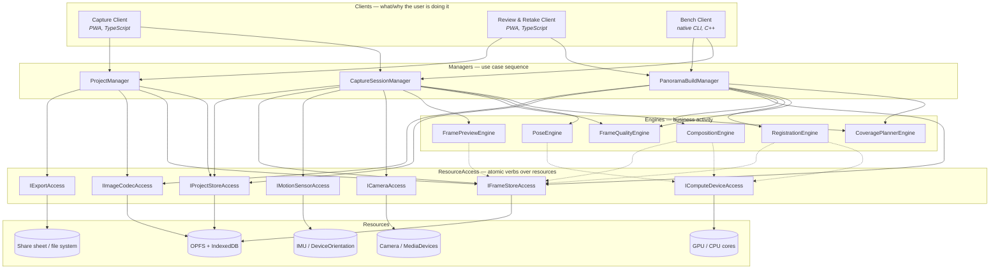
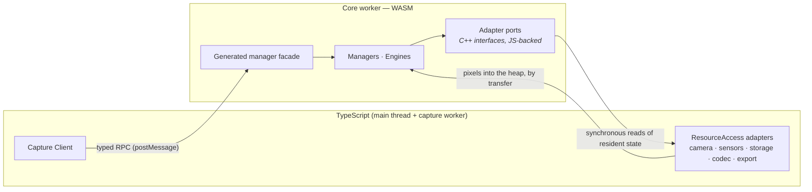
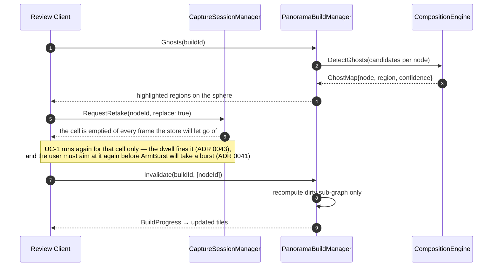

# 3. Architecture

## 3.1 Service map



A **utilities bar** (`ILogger`, `IClock`, `IConfigStore`, `IArena`, `IDiagnosticsSink`,
`Result<T>`) is available to every layer and is omitted from the diagram for legibility.

Dotted edges are the one sanctioned exception to "engines are pure" — see the call rules.

## 3.2 Layer responsibilities

**Clients** own *what the user is trying to do and how it is presented*. The Capture Client renders
the viewfinder, reticles, and guidance; the Review Client renders the sphere, per-cell inspection
and retake requests. Clients hold **no** stitching or capture logic — they translate gestures into
manager calls and manager events into pixels on screen. A third client, a native CLI **Bench**, is
designed in so every engine can be exercised on a desktop against real datasets without a browser.
Its existence is an architectural constraint rather than a description of the tree: `bench/` is not
built yet — the roadmap defers it, and what enforces the constraint meanwhile is the no-browser
checker plus the native build and its sanitizers, which compile and run the whole core with no
Emscripten in sight. It becomes worth building now that `tools/synth_dataset.py` produces the real
datasets it was meant to consume.

**Managers** own *sequence*. They are the only stateful business components. There are three, one
per use-case family, and they do not call each other synchronously (§3.3).

**Engines** own *activity*. They are stateless with respect to a session — every call takes its
inputs explicitly and returns a value. This is what makes them testable against golden data and
comparable against a Python reference implementation.

Where an engine accumulates over time, the accumulated state is a **named contract value the
manager owns** and passes back in: `IPoseEngine.Integrate(const PoseState& prior, samples)` returns
the next `PoseState`, and `CaptureSessionManager` holds it. A contract shaped so that the state has
nowhere to live but engine members is a contract defect, not an exception to this rule — see
ADR [0016](adr/0016-pose-state-is-a-value-the-manager-owns.md), which is the fix for one.

**ResourceAccess** turns a resource's raw API into atomic business verbs. `ICameraAccess` exposes
`PeekPreviewFrame()` and a lens, not `getUserMedia`. *Atomic* is the operative word: it had a
`CaptureBurst(BurstSpec)` too, and that was the one verb that could not be implemented, because a
burst takes time and a synchronous port has none to give. Sequencing several atomic calls into
something that takes time is a manager's job — see ADR
[0018](adr/0018-the-burst-is-paced-by-the-manager-over-a-resident-frame.md). This layer is where every browser API and every
platform quirk lives, and it is the layer whose implementations are written in TypeScript
(§3.5).

**Resources** are the actual devices and stores.

## 3.3 Call rules (enforced, not aspirational)

1. Clients call **Managers only**. Never engines, never resource access.
2. Managers call Engines, ResourceAccess, and utilities. A manager may skip the engine layer to
   reach ResourceAccess directly.
3. Managers **do not call other managers**. Where a use case spans two (e.g. "finish capture, then
   build"), the client sequences it, or the originating manager publishes an event that the other
   subscribes to via the utilities-bar bus.
4. Engines **never** call managers, never call each other, and never hold session state.
5. Engines may call exactly two resource accesses — `IComputeDeviceAccess` and
   `IFrameStoreAccess` — because compute placement and pixel residency are properties of the
   platform, not of the algorithm, and threading them through every signature as parameters would
   invert the dependency for no gain. All other resources reach an engine as function arguments.
6. ResourceAccess calls resources only. No business rules, no policy, no cross-resource
   orchestration — with the same exception as rule 5, and for the same reason: a port may call
   `IFrameStoreAccess`. `ICameraAccess::PeekPreviewFrame` returns a `FrameRef`, so a port that
   produces pixels has to put them somewhere, and where bytes live is V11's business universally
   rather than each port's (ADR 0021). No other port-to-port edge is legal.
7. Nothing calls upward. Results flow back as return values; asynchronous progress flows back as
   utility-bar events.

These rules are checked mechanically: `tools/layer_check.py` parses the include graph and fails
the build on a violating edge (see [05](05-toolchain-and-testing.md)). This is why contracts are
one interface per header — under an aggregate header, a manager *calling* another manager is
indistinguishable from a manager *implementing* its own interface, and rule 3 would be
unenforceable (ADR [0008](adr/0008-contracts-are-the-include-path.md)).

## 3.4 The three managers

### CaptureSessionManager (V1)
Owns a live session. Holds the coverage plan, the per-cell candidate sets, and the current pose
estimate. Its loop is:

- `OnMotion(samples)` → asks `PoseEngine` for an orientation, asks `CoveragePlannerEngine` which
  cell that orientation targets and how far off it is, returns `CaptureGuidance` (which reticle,
  angular error, stability, "hold still", "fire").
- `OfferFrame(frame, pose)` → asks `FrameQualityEngine` to score it, decides whether it joins the
  cell's candidate set (and whether the burst continues), asks `CoveragePlannerEngine` whether the
  cell is now satisfied, persists through `IFrameStoreAccess`/`IProjectStoreAccess`.
- `RequestRetake(nodeId, replace)` → with `replace`, clears a cell's candidates — every one whose
  frame the store will let go of — so the cell becomes a hole again and the dwell can fire on it.
  Additively it marks nothing a client can act on in this build; see UC-2 and the contract.
- `CandidatePreview(node, candidate, maxEdge)` → asks `FramePreviewEngine` for a reduced copy of
  one candidate's frame, and puts the frame back in the tier it found it in. This is the only call
  in the contracts that answers with pixels, and the reduction is why: a review client needs to
  *see* the frames, and 39 MB of a cell's full frames across a 128 MB budget is what a `FrameRef`
  exists to prevent (ADR 0038).

It never stitches and never blends.

### PanoramaBuildManager (V2)
Owns a build. Takes a session's selections and drives:
`RegistrationEngine` (features → pairwise → global refine) → `CompositionEngine` (exposure → ghost
detection → seams → blend → project). Emits staged progress and a low-resolution preview long
before the final render.

Its distinguishing responsibility is **incremental invalidation**: `Invalidate(buildId, dirtyNodes)`
recomputes only the sub-graph a retake touched — the changed cell, its neighbours' pairwise edges,
the affected seam region — and re-blends the affected tiles. This is the mechanism behind goal G3,
and it is the reason the build is modelled as a graph and not a pipeline run (§4.4).

### ProjectManager (V3)
Owns projects across sessions: list, create, delete, and export. Not resume — picking a capture
back up means holding a live session, and that is `CaptureSessionManager`'s (ADR 0029). It does
report *that* there is one: `ProjectSummary.hasSession` says a session document exists, which is
metadata about a project rather than a session anybody can be handed, and it is what lets a client
offer a resume instead of discovering one by attempting it (ADR 0036). Export means asking
`IImageCodecAccess` to encode and attach XMP `GPano` metadata, then handing bytes to
`IExportAccess`. It is the only manager that touches `IExportAccess`.

## 3.5 The boundary that makes this work

The core is C++/WASM; the browser APIs are JavaScript. iDesign says resource access encapsulates
the resource — so the **contracts** for `ICameraAccess` and `IMotionSensorAccess` are declared in
C++ as abstract interfaces inside the core, and their **implementations** are TypeScript adapters
injected across the boundary at startup.



Two edges in that diagram were drawn before the boundary existed and have since been decided
differently. Ports are **not** Embind or JSPI callbacks: they are synchronous reads and writes of
state the JavaScript side keeps resident, over a C ABI (ADR [0012](adr/0012-c-abi-boundary-not-embind.md),
ADR [0014](adr/0014-synchronous-ports-over-a-resident-host.md)). And pixels reach the heap by
**transfer** rather than through a `SharedArrayBuffer` view, because a shared view needs
cross-origin isolation and the deployment target cannot serve the headers for it (ADR
[0011](adr/0011-single-threaded-build-for-github-pages.md)); the shared-view path returns if the
app is ever served isolated.

Two rules keep this from becoming a performance disaster:

- **Control crosses the boundary; frames do not.** Frame bytes are written once into the WASM heap
  — transferred in as an `ArrayBuffer`, or copied straight into a heap view where a shared one is
  available — and thereafter referred to by handle. No *frame* is ever serialised by value.

  There is one image that crosses outward, and the exception is measured rather than granted:
  `CandidatePreview` answers with a `FramePreview`, a copy reduced to a long edge the caller names
  and the contract bounds. The rule is a rule about cost — a cell's frames are 39 MB, its previews
  are 384 KB — and reducing is what pays it. A handle cannot do this job in this direction at all,
  because there is no frame store on the page to resolve one against (ADR 0038).
- **The boundary is generated, not hand-written.** One IDL produces the C++ facade, the TS client
  proxy, and the shared value types (§4.6), so a contract change is a compile error on both sides
  rather than a runtime surprise.

`IFrameStoreAccess`, `IProjectStoreAccess`, `IImageCodecAccess` and `IComputeDeviceAccess` have
**two** implementations each — a TypeScript one for the browser, and a native one used by the
Bench client — behind the identical C++ contract.

### One coordinate frame, converted at the edge

Every `Quat` that crosses a contract — a plan's target orientation, an `ImuSample`'s attitude, a
`PoseSample` — is in **one frame: +Y up, −Z forward, +X right**. `FromAzimuthElevation` and
`Direction` in the utilities bar are the definition; azimuth turns about +Y and elevation lifts
toward it.

Platforms do not agree with that and are not asked to. `DeviceOrientationEvent` reports intrinsic
Z-X'-Y'' Tait-Bryan angles against an east-north-up earth frame; `AbsoluteOrientationSensor`
reports the same rotation as a quaternion, and an Android rotation vector differs again.
**Converting is the adapter's job** (V10), done once in `shell/src/access/orientation.ts` — see
ADR 0015. Nothing above resource access ever sees a second convention, which is what lets
`CoveragePlannerEngine` compare a sensor reading to a plan cell with a single `AngleBetween`.

That frame is about *directions*. A **pixel** needs a second convention, and the two disagree about
one axis: image space is the ordinary raster one, **+x right and +y down**, with the origin at the
image's top-left corner, so a pixel's centre sits at a half-integer. `utilities/camera_model` is
where the two meet and where the Y flip between them happens, once (ADR 0046). Note the half pixel
against OpenCV, which puts a pixel centre at an integer: distortion coefficients transfer unchanged
because they live in normalised coordinates, and `cx`/`cy` from such a calibration do not.

The frame is the **viewfinder's**, not the chassis'. Every platform reading describes the case the
user is holding, and the browser re-orients the page inside it; the adapter folds
`screen.orientation.angle` in so that +X means "the right edge of the picture" (ADR 0017). Roll is
measured from that axis, so getting it wrong is a level horizon drawn on end in landscape and
nothing else — which is why it survived a phase.

## 3.6 Use-case walkthroughs

### UC-1 · Guided burst capture of one cell

```mermaid
sequenceDiagram
  autonumber
  participant U as Capture Client
  participant M as CaptureSessionManager
  participant P as PoseEngine
  participant V as CoveragePlannerEngine
  participant Q as FrameQualityEngine
  participant C as ICameraAccess
  participant F as IFrameStoreAccess

  U->>M: OnMotion(imu batch)
  M->>P: Integrate + Stability
  P-->>M: pose, stability
  M->>V: Locate(pose, plan)
  V-->>M: nodeId, angular error
  M-->>U: Guidance{node, error, "hold still", heldFraction}
  Note over M: the dwell runs while the cell is held; about two seconds of ticks that carried samples
  M-->>U: Guidance{node, "fire"}
  Note over U: nobody presses anything (ADR 0043). The client applies and confirms the locks first (ADR 0022)
  U->>M: ArmBurst(node, burst)
  M->>C: SetLocks(exposure, white balance, focus)
  C-->>M: Ok, or FailedPrecondition naming the locks not held
  M->>C: Capabilities()
  C-->>M: what the camera is doing now — a pinned exposure is what drops it to 15 fps (ADR 0045)
  Note over M,C: ticks pass and no frame is taken for burst.settleMs, while the camera converges
  loop one frame per tick, no faster than burst.intervalMs
    U->>M: OnMotion(imu batch)
    M->>C: PeekPreviewFrame()
    C-->>M: FrameRef
    M->>Q: Score(frame, pose, nodeContext)
    Q-->>M: QualityScore
    M-->>U: Guidance{node, "firing"}
  end
  M->>Q: Rank(candidates, policy)
  Q-->>M: ranking
  M->>F: Demote(every candidate this session captured, spilled)
  M->>C: SetLocks(released)
  M->>V: Evaluate(plan, candidates)
  V-->>M: CoverageState{satisfied, holes}
  M-->>U: Guidance{node, "cell done"} + updated coverage
```

The burst rides on the tick the client was already making, because that is the only call made
often enough to pace one and a synchronous port cannot wait (ADR 0018). Arming is not firing: the
frames arrive over the ticks that follow, and the exposure lock is held across all of them —
including the first `settleMs` of them, during which no frame is taken at all. Applying a focus
lock makes a camera re-converge, and `PeekPreviewFrame` borrows the latest preview frame, so a
frame taken immediately is one from mid-refocus: on a Pixel that holds the lock it scored a
hundredth of what its siblings did (ADR 0032).

Note what the manager does *not* do: it does not decide what "best" means (V6), nor where a
reticle sits (V4), nor how bytes are stored (V11). It decides *when* to ask each of them — and the
demotion above is that rule rather than an exception to it. A ranked cell is finished, which is a
fact about the session's sequence and knowable nowhere else; what "cheaper" costs, whether there
is anywhere cheaper at all, and what happens when the frame is asked for again all stay inside
`IFrameStoreAccess` (ADR 0023).

### UC-2 · Retake a ghosted region



The client sequences the two managers; they never call each other.

A retake marks nothing — there is no retake flag on a node, in the manager or in `CoverageNode`.
What `RequestRetake` does is abort a burst in flight on that cell, and, in its replacing form,
empty the cell. The burst that fills it afterwards goes through `ArmBurst` like any
other and is refused while the camera is aimed somewhere else (ADR 0041), so a retake is an
instruction to go back and re-shoot rather than a shutter that fires where the phone happens to be
pointing — which is the failure that rule exists to stop. There is always an aim to check: a
session cannot begin on a device with no motion sensor (ADR 0044).

Only the replacing form of `RequestRetake` reaches that burst in this build, and the contract says
so rather than leaving a reader to find out. Keeping the existing evidence leaves the cell covered,
so guidance answers `AlreadyCaptured` and the dwell — which arms every burst since ADR 0043 — never
matures on it. And a replacing retake empties the cell of everything the frame store will let go
of: a frame it refuses to forget keeps its candidate, because the bytes are still charged and
dropping the last handle to them would orphan them. The retake flow that closes the additive case
is Phase 3.

### UC-3 · Pick a different frame from the burst by hand

The Review Client shows a cell's candidates ranked best-first, each with its scores and with the
frame itself — `CaptureSessionManager.CandidatePreview` reduces one to something a canvas can take,
because the scores alone cannot answer whether the thing the user wanted is even in the picture
(ADR 0038). Choosing one is
`ProjectManager.SetSelection(project, node, candidate)` followed by
`PanoramaBuildManager.Invalidate(buildId, [node])` — the *same* dirty path as a retake. One
mechanism, two features. That is the payoff of modelling the build as a graph.

### UC-4 · No motion sensors (permission denied on iOS)

`IMotionSensorAccess.Capabilities()` reports `none`, or fails to answer. `CaptureSessionManager`
refuses: `Begin` and `Resume` return `SensorUnavailable`, before either opens a camera, and the
page turns that into a sentence saying what is required and what is missing (ADR 0044).

It used to capture. `PoseEngine` went into vision-only mode, guidance targeted by coverage instead
of by aim, `ArmBurst` declined to enforce a cone it had nothing to measure against, and the user
aimed by eye. All of that worked. What it produced was the problem: cells filled in coverage order
with whatever the camera happened to be pointing at, nothing anywhere verified that a cell's frames
came from that cell's direction, and the failure was invisible until a build stage this repo does
not have yet. Vision-only orientation is what would make those labels true — frame-to-frame
tracking seeded by `RegistrationEngine` — and `RegistrationEngine` is null. Until it is not, the
honest answer is a message rather than a sphere.

`PoseMode::VisionOnly` stays in the contract and nothing selects it. It is what such a capture
would run in the day the registration engine can carry one; ADR 0044 is the record of why nothing
reaches it today.

`CapturePlanSpec` still carries a `motion` field and the manager still fills it from the live
capability — but **no planner reads it**, so the claim that `CoveragePlannerEngine` switches to a
looser acceptance tolerance has never been true. The cone is whatever the client asked for.

One rule per question survives this, which is the other half of what it bought. `Locate` names the
cell the camera is inside; `ArmBurst` refuses a burst on two counts — nothing has measured where
the camera is pointing, or what was measured is outside that cone; the dwell fires. Zero
`PoseSample.confidence` still happens — a session's opening ticks arrive before its first reading,
and a stream carrying angular rates with no attitude in them never anchors at all — and it means
"no aim yet" rather than "no aim ever": guidance seeks, no cell is held, and nothing can be armed.
The page reads the `aimKnown` the planner publishes to park its reticle and stop correcting for
roll, which is presentation rather than a second copy of the rule.

### UC-5 · Coming back to a capture a phone call interrupted

At load the Capture Client calls `ProjectManager.List()` and looks for the newest summary carrying
`hasSession`. If there is one it offers a resume beside the ordinary enable; both are the same user
gesture, because a resume needs the camera and the sensor exactly as a new capture does. Pressed,
it establishes the motion capability first — a device reporting none is turned away before
`getUserMedia`, so nobody answers a camera prompt on the way to being told the session cannot start
(ADR 0044) — then opens the camera, pushes the lens to the host, and calls
`CaptureSessionManager.Resume(project)`
instead of `Create` plus `Begin` — the manager reads the document it wrote, replans from the spec
and lens that document carries, and hands the frames it names back to the store, so the cells
already captured keep counting (ADR 0029).

A client sequencing two managers, and the boundary is what keeps it honest: the first call answers
whether to offer, the second is the only thing that hands back a session. A refusal from the second
— a document this build cannot read, a plan the stored spec no longer produces, frames the tier
lost — goes on screen through `describeFailure`, and a new capture stays one press away.

Except where nothing a press could do would change the answer, and then the offer goes with it.
`Unsupported` waits for a new build and `SensorUnavailable` waits for a reload, so leaving either
on screen would invite a press that fails identically (ADR 0039, narrowed by ADR 0044). The
capture itself is untouched in both cases, though not for the reason this once gave: `Unsupported`
*is* the document being read and failing to decode, and `SensorUnavailable` is checked after that
read. What makes the sphere safe is that neither refusal mutates anything — `ReadDocument` is a
read, and nothing before the sensor check writes — so what goes is the offer, not the sphere.
