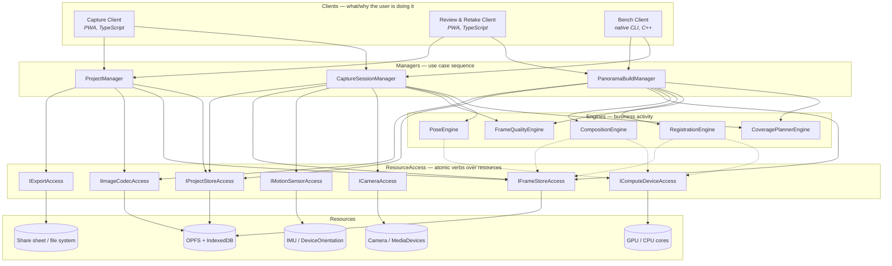
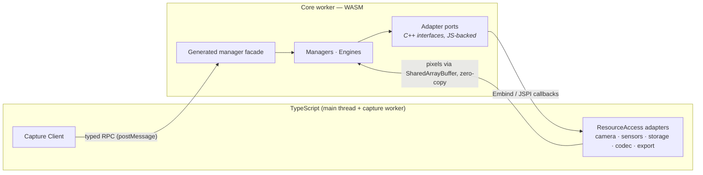
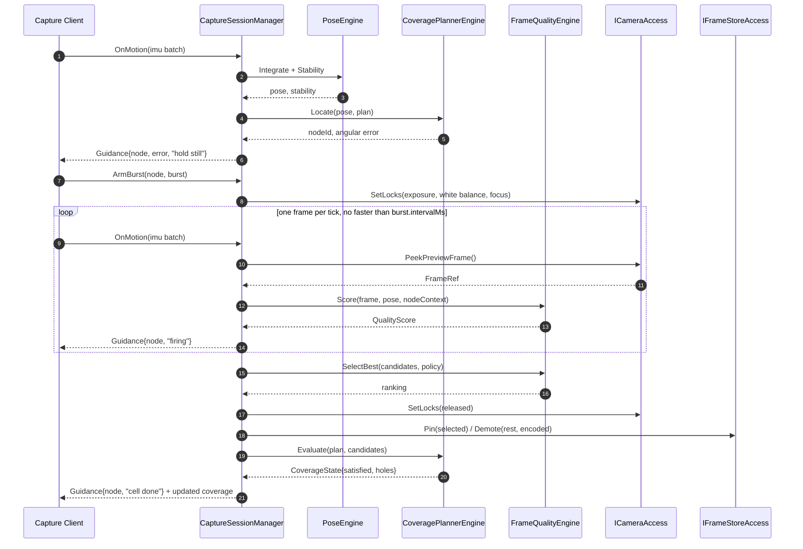
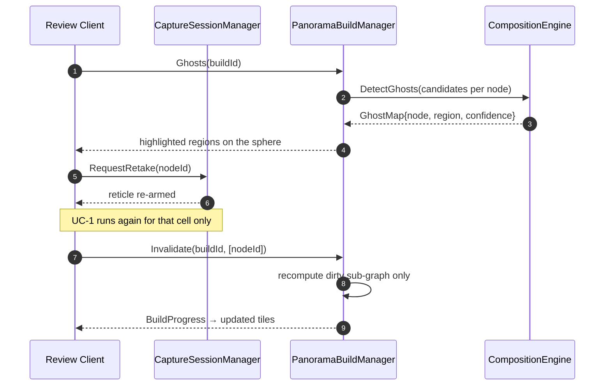

# 3. Architecture

## 3.1 Service map

A **utilities bar** (`ILogger`, `IClock`, `IConfigStore`, `IArena`, `IDiagnosticsSink`,
`Result<T>`) is available to every layer and is omitted from the diagram for legibility.

Dotted edges are the one sanctioned exception to "engines are pure" — see the call rules.

## 3.2 Layer responsibilities

**Clients** own *what the user is trying to do and how it is presented*. The Capture Client renders
the viewfinder, reticles, and guidance; the Review Client renders the sphere, per-cell inspection
and retake requests. Clients hold **no** stitching or capture logic — they translate gestures into
manager calls and manager events into pixels on screen. A third client, a native CLI **Bench**,
exists from day one so every engine can be exercised on a desktop against real datasets without a
browser. Its existence is an architectural constraint: it forces the core to be free of browser
assumptions.

**Managers** own *sequence*. They are the only stateful business components. There are three, one
per use-case family, and they do not call each other synchronously (§3.3).

**Engines** own *activity*. They are stateless with respect to a session — every call takes its
inputs explicitly and returns a value. This is what makes them testable against golden data and
comparable against a Python reference implementation.

Where an engine accumulates over time, the accumulated state is a **named contract value the
manager owns** and passes back in: `IPoseEngine.Integrate(const PoseState& prior, samples)` returns
the next `PoseState`, and `CaptureSessionManager` holds it. A contract shaped so that the state has
nowhere to live but engine members is a contract defect, not an exception to this rule — see
ADR [0016](adr/0016-pose-state-is-a-value-the-manager-owns.md), which is the fix for one.

**ResourceAccess** turns a resource's raw API into atomic business verbs. `ICameraAccess` exposes
`PeekPreviewFrame()` and a lens, not `getUserMedia`. *Atomic* is the operative word: it had a
`CaptureBurst(BurstSpec)` too, and that was the one verb that could not be implemented, because a
burst takes time and a synchronous port has none to give. Sequencing several atomic calls into
something that takes time is a manager's job — see ADR
[0018](adr/0018-the-burst-is-paced-by-the-manager-over-a-resident-frame.md). This layer is where every browser API and every
platform quirk lives, and it is the layer whose implementations are written in TypeScript
(§3.5).

**Resources** are the actual devices and stores.

## 3.3 Call rules (enforced, not aspirational)

1. Clients call **Managers only**. Never engines, never resource access.
2. Managers call Engines, ResourceAccess, and utilities. A manager may skip the engine layer to
   reach ResourceAccess directly.
3. Managers **do not call other managers**. Where a use case spans two (e.g. "finish capture, then
   build"), the client sequences it, or the originating manager publishes an event that the other
   subscribes to via the utilities-bar bus.
4. Engines **never** call managers, never call each other, and never hold session state.
5. Engines may call exactly two resource accesses — `IComputeDeviceAccess` and
   `IFrameStoreAccess` — because compute placement and pixel residency are properties of the
   platform, not of the algorithm, and threading them through every signature as parameters would
   invert the dependency for no gain. All other resources reach an engine as function arguments.
6. ResourceAccess calls resources only. No business rules, no policy, no cross-resource
   orchestration.
7. Nothing calls upward. Results flow back as return values; asynchronous progress flows back as
   utility-bar events.

These rules are checked mechanically: `tools/layer_check.py` parses the include graph and fails
the build on a violating edge (see [05](05-toolchain-and-testing.md)). This is why contracts are
one interface per header — under an aggregate header, a manager *calling* another manager is
indistinguishable from a manager *implementing* its own interface, and rule 3 would be
unenforceable (ADR [0008](adr/0008-contracts-are-the-include-path.md)).

## 3.4 The three managers

### CaptureSessionManager (V1)
Owns a live session. Holds the coverage plan, the per-cell candidate sets, and the current pose
estimate. Its loop is:

- `OnMotion(samples)` → asks `PoseEngine` for an orientation, asks `CoveragePlannerEngine` which
  cell that orientation targets and how far off it is, returns `CaptureGuidance` (which reticle,
  angular error, stability, "hold still", "fire").
- `OfferFrame(frame, pose)` → asks `FrameQualityEngine` to score it, decides whether it joins the
  cell's candidate set (and whether the burst continues), asks `CoveragePlannerEngine` whether the
  cell is now satisfied, persists through `IFrameStoreAccess`/`IProjectStoreAccess`.
- `RequestRetake(nodeId)` → clears or supplements a cell's candidates and re-arms that reticle.

It never stitches and never blends.

### PanoramaBuildManager (V2)
Owns a build. Takes a session's selections and drives:
`RegistrationEngine` (features → pairwise → global refine) → `CompositionEngine` (exposure → ghost
detection → seams → blend → project). Emits staged progress and a low-resolution preview long
before the final render.

Its distinguishing responsibility is **incremental invalidation**: `Invalidate(buildId, dirtyNodes)`
recomputes only the sub-graph a retake touched — the changed cell, its neighbours' pairwise edges,
the affected seam region — and re-blends the affected tiles. This is the mechanism behind goal G3,
and it is the reason the build is modelled as a graph and not a pipeline run (§4.4).

### ProjectManager (V3)
Owns projects across sessions: list, open, resume, delete, and export. Export means asking
`IImageCodecAccess` to encode and attach XMP `GPano` metadata, then handing bytes to
`IExportAccess`. It is the only manager that touches `IExportAccess`.

## 3.5 The boundary that makes this work

The core is C++/WASM; the browser APIs are JavaScript. iDesign says resource access encapsulates
the resource — so the **contracts** for `ICameraAccess` and `IMotionSensorAccess` are declared in
C++ as abstract interfaces inside the core, and their **implementations** are TypeScript adapters
injected across the boundary at startup.

Two rules keep this from becoming a performance disaster:

- **Control crosses the boundary; pixels do not.** Frame bytes are written once into a
  WASM-visible `SharedArrayBuffer` ring by the capture worker (`VideoFrame.copyTo` straight into a
  heap view) and thereafter referred to by handle. No pixel array is ever serialised through
  `postMessage`.
- **The boundary is generated, not hand-written.** One IDL produces the C++ facade, the TS client
  proxy, and the shared value types (§4.6), so a contract change is a compile error on both sides
  rather than a runtime surprise.

`IFrameStoreAccess`, `IProjectStoreAccess`, `IImageCodecAccess` and `IComputeDeviceAccess` have
**two** implementations each — a TypeScript one for the browser, and a native one used by the
Bench client — behind the identical C++ contract.

### One coordinate frame, converted at the edge

Every `Quat` that crosses a contract — a plan's target orientation, an `ImuSample`'s attitude, a
`PoseSample` — is in **one frame: +Y up, −Z forward, +X right**. `FromAzimuthElevation` and
`Direction` in the utilities bar are the definition; azimuth turns about +Y and elevation lifts
toward it.

Platforms do not agree with that and are not asked to. `DeviceOrientationEvent` reports intrinsic
Z-X'-Y'' Tait-Bryan angles against an east-north-up earth frame; `AbsoluteOrientationSensor`
reports the same rotation as a quaternion, and an Android rotation vector differs again.
**Converting is the adapter's job** (V10), done once in `shell/src/access/orientation.ts` — see
ADR 0015. Nothing above resource access ever sees a second convention, which is what lets
`CoveragePlannerEngine` compare a sensor reading to a plan cell with a single `AngleBetween`.

The frame is the **viewfinder's**, not the chassis'. Every platform reading describes the case the
user is holding, and the browser re-orients the page inside it; the adapter folds
`screen.orientation.angle` in so that +X means "the right edge of the picture" (ADR 0017). Roll is
measured from that axis, so getting it wrong is a level horizon drawn on end in landscape and
nothing else — which is why it survived a phase.

## 3.6 Use-case walkthroughs

### UC-1 · Guided burst capture of one cell

The burst rides on the tick the client was already making, because that is the only call made
often enough to pace one and a synchronous port cannot wait (ADR 0018). Arming is not firing: the
frames arrive over the ticks that follow, and the exposure lock is held across all of them.

Note what the manager does *not* do: it does not decide what "best" means (V6), nor where a
reticle sits (V4), nor how bytes are stored (V11). It decides *when* to ask each of them.

### UC-2 · Retake a ghosted region

The client sequences the two managers; they never call each other.

### UC-3 · Pick a different frame from the burst by hand

The Review Client shows a cell's candidates with their scores. Choosing one is
`ProjectManager.SetSelection(project, node, candidate)` followed by
`PanoramaBuildManager.Invalidate(buildId, [node])` — the *same* dirty path as a retake. One
mechanism, two features. That is the payoff of modelling the build as a graph.

### UC-4 · No motion sensors (permission denied on iOS)

`IMotionSensorAccess.Capabilities()` reports `none`. `CaptureSessionManager` configures
`PoseEngine` in vision-only mode, where orientation comes from frame-to-frame tracking seeded by
`RegistrationEngine` output rather than from integration. `CoveragePlannerEngine` switches to a
looser acceptance tolerance. No other component learns that sensors were absent — the volatility
is contained in V5 plus one flag in the plan spec.
