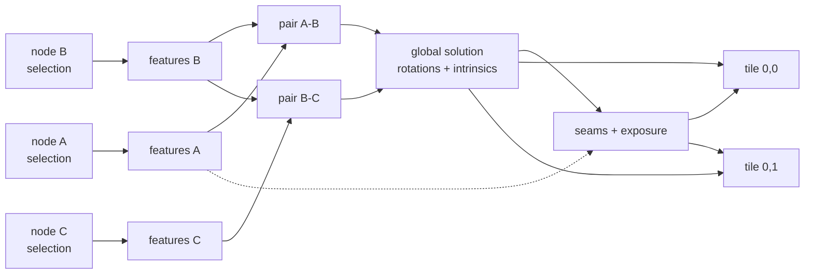

# 4. Runtime topology, memory and data model

## 4.1 Threads

| Context | Contents | Why separate |
| ------- | -------- | ------------ |
| Main thread | Capture/Review Clients, DOM, WebGL preview, permission prompts | Must never block; sensor and gesture events land here |
| Capture worker | `ICameraAccess` + `IMotionSensorAccess` adapters, `VideoFrame` → heap copy | Frame acquisition must not compete with UI layout |
| Core worker | WASM module: all managers, engines, adapter ports | Business logic runs off the UI thread by construction |
| Core pthread pool | Emscripten pthreads for engine parallelism (feature extraction, blending) | Sized from `navigator.hardwareConcurrency`; **may be zero** |
| GPU queue | WebGPU compute for warping/blending when available | Optional, capability-detected |

Cross-origin isolation (`COOP: same-origin`, `COEP: require-corp`) is required for
`SharedArrayBuffer` and therefore for the pthread pool. The app must run correctly without it:
`IComputeDeviceAccess.Capabilities()` reports `threads: 0`, engines take their serial path, and
frames cross the boundary by transfer instead of by shared view. This is a supported degraded
mode, tested in CI — not a bug to fix later.

## 4.2 Memory tiers

Frames are the dominant cost, so residency is an explicit service (`IFrameStoreAccess`) with four
tiers:

| Tier | Holds | Policy |
| ---- | ----- | ------ |
| GPU texture | Tiles being warped/blended right now | Evicted at stage boundaries |
| WASM heap (pinned) | The frame under analysis; selected candidates during a build | Bounded by a byte budget derived from a probe at startup |
| WASM heap (encoded) | Non-selected burst candidates, JPEG at capture quality | The default resting place for a burst |
| OPFS spill | Everything that exceeds the budget; the whole session across a reload | Content-addressed by frame hash |

The budget probe matters: mobile WASM heaps are bounded and an OOM is an unrecoverable page crash,
not an exception. The store allocates against a measured ceiling with a safety margin and spills
before it is reached. **Never** hold a whole burst of full-resolution frames for the whole sphere —
that is tens of gigabytes.

Output panoramas are tiled (typically 512² tiles over an equirectangular grid) so blending, preview
and export all work on bounded working sets, and so a retake re-blends a handful of tiles rather
than an 8K×4K image.

## 4.3 The session document

```
Project
├── id, createdAt, title, thumbnailRef
├── CapturePlan          # from CoveragePlannerEngine, V4
│   ├── strategy, ringCount, cellFov, overlapTarget
│   └── Node[]  { nodeId, targetOrientation (quat), acceptanceCone }
├── Node state[]
│   ├── nodeId, state: {pending, captured, satisfied, flagged, retaking}
│   ├── Candidate[]  { candidateId, frameRef, pose, quality, capturedAt }
│   └── selection: candidateId | auto
├── Calibration          # estimated intrinsics + distortion, refined during build
└── Build[]
    ├── buildId, spec {quality tier, projection, output size}
    ├── graph fingerprint
    └── artefacts { tileRefs, previewRef, ghostReport }
```

Everything except pixel payloads lives in `IProjectStoreAccess` (IndexedDB). Pixels live in
`IFrameStoreAccess` (OPFS), referenced by handle. The split exists so that "resume my session
after the browser killed the tab" is a metadata read plus lazy pixel faulting, not a restore.

## 4.4 The build graph

A build is a DAG, not a pipeline run:



Every node is keyed by a fingerprint of its inputs (content hash of the selected frame, pose,
parameters, engine version). `Invalidate(dirtyNodes)` marks the transitive closure downstream of
the changed nodes and recomputes only that. Consequences:

- A retake or a manual candidate switch re-runs one cell's features, ~4–6 pairwise edges, the
  global solve (cheap, it is a few hundred parameters), and the tiles the cell touches.
- Cached stage outputs survive a reload because the fingerprint is stable.
- The global solve deliberately stays a full recompute: re-solving all rotations is milliseconds
  and partial solves would bake in drift.

## 4.5 Ghost detection (why the burst is kept)

Because a cell holds several frames taken seconds apart, a mover is directly observable: warp a
cell's candidates into a common frame and the disagreement mask is the moving content. That mask
feeds three things — a penalty in `FrameQualityEngine` selection (V6), a cost term in seam finding
so seams route *around* movers (V8), and the ghost report the Review Client highlights for
retakes. Overlapping cells give a second, independent signal for the same region.

This is the concrete reason burst capture and ghost removal are the same feature, and why the
candidate set must survive into the build rather than being collapsed at capture time.

## 4.6 Contracts and codegen

One source of truth: **the C++ contract headers are the IDL**
(ADR [0009](adr/0009-the-cpp-header-is-the-idl.md)). `tools/contract_gen.py` parses them and emits
`contracts/ts/contracts.d.ts`; CI regenerates and fails on any diff, so the mirror cannot drift.

The parser accepts only a small declared subset and raises on anything outside it. That strictness
is the mechanism rather than a limitation — a lenient parser would silently drop what it did not
understand, and the mirror would drift exactly where nobody was looking.

Only interfaces marked `// @boundary` are mirrored. Engines and the utilities bar never cross into
JavaScript. Three resource accesses are also excluded — motion sensor, frame store and compute
device — because their signatures move bytes through the shared heap rather than through marshalled
values; their TypeScript adapters are written against the shared-heap protocol instead, and
mirroring the C++ signature would describe a call that does not exist.

Wire encoding is a **binary codec generated from that same parse** — `contracts/cpp/sphanorama/codec.h`
and `shell/src/bridge/codec.generated.ts` — over hand-written primitives in `wire.h` / `wire.ts`
(ADR [0013](adr/0013-generated-binary-codec.md)). A golden payload asserted by both the C++ and the
TypeScript suite pins the two halves to each other, so a disagreement about field order fails a
test rather than decoding into plausible nonsense.

FlatBuffers remains the right answer for zero-copy over large payloads and nothing here forecloses
it; pixels never cross this way in any case. Not yet built: the method dispatch on top of the
codec, so the client still reaches only the capability probe.

## 4.7 Error model

No exceptions cross the WASM boundary and none are used in the core. Every fallible call returns
`Result<T>` carrying a `Status { code, component, detail }`. Codes are a closed enum shared with
TypeScript, so the client can react to `SensorPermissionDenied` or `FrameStoreExhausted`
specifically rather than parsing strings. Panics in the core are logged through the utilities bar
and surfaced as a build failure, never as a silent stall.
