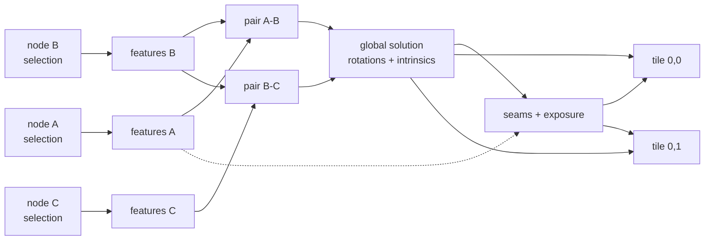

# 4. Runtime topology, memory and data model

## 4.1 Threads

| Context | Contents | Why separate |
| ------- | -------- | ------------ |
| Main thread | Capture/Review Clients, DOM, WebGL preview, permission prompts | Must never block; sensor and gesture events land here |
| Capture worker | `ICameraAccess` + `IMotionSensorAccess` adapters, `VideoFrame` → heap copy | Frame acquisition must not compete with UI layout |
| Core worker | WASM module: all managers, engines, adapter ports | Business logic runs off the UI thread by construction |
| Core pthread pool | Emscripten pthreads for engine parallelism (feature extraction, blending) | Sized from `navigator.hardwareConcurrency`; **may be zero** |
| GPU queue | WebGPU compute for warping/blending when available | Optional, capability-detected |

The **capture worker is the target, not the starting point**. It needs
`MediaStreamTrackProcessor` to get a track's frames into a worker at all, which Safari does not
have, so the camera and motion adapters begin in the main thread and push: the page posts IMU
batches and the camera's capabilities, and transfers the latest frame's buffer, all of which the
core worker holds resident to read synchronously (ADR 0019, ADR 0021). One new context rather than
two, and it works everywhere. Splitting acquisition out is a Chromium-only improvement to make
later, and it changes nothing above the adapters.

The frame is drawn from the `<video>` into a canvas and read back as RGBA8, capped at 1280 on its
long edge — a memory budget rather than a quality setting, since nothing in this path compresses
anything and a five-frame burst at full phone resolution would be 240 MB. The page grabs one only
while a burst can use it, which makes the ordering load-bearing: the frame must be resident before
the tick that consumes it, because the core reads it synchronously and has nothing to wait with.

Cross-origin isolation (`COOP: same-origin`, `COEP: require-corp`) is required for
`SharedArrayBuffer` and therefore for the pthread pool. The app must run correctly without it:
`IComputeDeviceAccess.Capabilities()` reports `threads: 0`, engines take their serial path, and
frames cross the boundary by transfer instead of by shared view. This is a supported degraded
mode, tested in CI — not a bug to fix later.

## 4.2 Memory tiers

Frames are the dominant cost, so residency is an explicit service (`IFrameStoreAccess`) with four
tiers:

| Tier | Holds | Policy |
| ---- | ----- | ------ |
| GPU texture | Tiles being warped/blended right now | Evicted at stage boundaries |
| WASM heap (pinned) | The frame under analysis; selected candidates during a build | Bounded by a byte budget derived from a probe at startup |
| WASM heap (encoded) | Non-selected burst candidates, JPEG at capture quality | The default resting place for a burst |
| OPFS spill | Everything that exceeds the budget, for the life of the session | Keyed by the store's frame identity |

Only the first three are the store's own business. **Where a spilled frame's bytes actually go is
behind `ISpillSink`** — a seam inside the frame-store component rather than a port beside it, so
the tiering, the ceiling and the fault-in exist once and the destination is a constructor argument
(ADR 0020). The browser's sink is one OPFS sync access handle opened at worker startup (ADR 0019),
which is why the row says frame identity rather than content hash — one handle means the sink owns
offsets inside a single file, and content-addressing would need refcounting to make `Drop` safe
for two frames that happen to match.

**The spill does not survive a reload**, and the row above used to say it did. The handle is
truncated when the worker opens it, because a frame's identity is a counter that restarts with the
store: the offsets in yesterday's file mean nothing to today's `FrameId`, so keeping the bytes
would keep them unreachable. Resuming a session's *pixels* across a reload needs the store's
identities to be persistent, which is a design question the project store's session record has not
been asked yet.

A store with **no sink has no spill tier at all** and refuses to demote to one. That is the native
build's situation, and it is a ceiling refusal on a desktop rather than a dead tab on a phone. It
used to relabel instead — the budget moved and the bytes stayed — which frees room the machine
does not have; a store whose reason to exist is modelling memory pressure cannot be the thing that
misreports it.

The ceiling matters: mobile WASM heaps are bounded and an OOM is an unrecoverable page crash, not
an exception. The store allocates against it with a safety margin and **refuses at it**; it never
evicts to make room. What keeps a capture away from that refusal is above it:
`CaptureSessionManager` cools a cell on every way out of a burst — completion, failure, retake or
the end of a session — offering the sink every candidate its own bursts produced, because a
finished cell is not read again until the build or the review client asks and both of those go
through `Pin` (ADR 0023). Frames offered through `OfferFrame` belong to the caller and are left
where they are. Peak heap during a capture is therefore one burst plus
whatever a retake faults back in to score against, rather than the whole sphere so far.

The store's refusal is the backstop rather than the normal case, and a cooling that fails is not
one: a store with no sink, or a sink out of quota, leaves the frames in the heap and the session
carries on until an allocation genuinely does not fit.

In the browser that ceiling is **read from the device**: a sixteenth of `navigator.deviceMemory`,
clamped by three quarters of what the module was linked to allow, floored where one burst stops
fitting. `bridge/heap_budget.h` carries the arithmetic and the reasoning. Two limits belong here
rather than in a surprise later. Safari and Firefox decline to report `deviceMemory` — it
fingerprints the device — so every iPhone takes a stated fallback and this scales with the machine
only on Chromium. And it reads the device rather than confirming what the tab will be allowed to
keep, which nothing in the platform answers: the obvious probe, allocating until it fails, is
ruled out because WASM heap growth is one-way (the test would permanently reserve what it tested)
and because approaching the allocator's refusal is approaching the tab death this exists to avoid.

Natively the ceiling is still a constant, deliberately: the bench runs on a desktop where the
failure mode does not exist. **Never** hold a whole burst of full-resolution frames for the whole
sphere — that is tens of gigabytes.

Output panoramas are tiled (typically 512² tiles over an equirectangular grid) so blending, preview
and export all work on bounded working sets, and so a retake re-blends a handful of tiles rather
than an 8K×4K image.

## 4.3 The session document

```
Project
├── id, createdAt, title, thumbnailRef
├── CapturePlan          # from CoveragePlannerEngine, V4
│   ├── strategy, ringCount, cellFov, overlapTarget
│   └── Node[]  { nodeId, targetOrientation (quat), acceptanceCone }
├── Node state[]
│   ├── nodeId, state: {pending, captured, satisfied, flagged, retaking}
│   ├── Candidate[]  { candidateId, frameRef, pose, quality, capturedAt }
│   └── selection: candidateId | auto
├── Calibration          # estimated intrinsics + distortion, refined during build
└── Build[]
    ├── buildId, spec {quality tier, projection, output size}
    ├── graph fingerprint
    └── artefacts { tileRefs, previewRef, ghostReport }
```

Everything except pixel payloads lives in `IProjectStoreAccess` (IndexedDB). Pixels live in
`IFrameStoreAccess` (OPFS), referenced by handle. The split exists so that "resume my session
after the browser killed the tab" is a metadata read plus lazy pixel faulting, not a restore.

That is what `ICaptureSessionManager::Resume` does: it reads the session document, replans from
the spec and lens the document carries, and hands every frame the document names back to the
store through `Adopt`, which registers it as spilled so the first `Pin` faults it in (ADR 0029).
The document is written on the way out of every burst rather than at `End`, because a tab the
browser killed never reached `End`. What is *not* done yet is the browser half: the OPFS spill
file is still per-session and swept when a new one opens, so on a phone the bytes an adopted
frame wants are not yet there to fault in.

## 4.4 The build graph

A build is a DAG, not a pipeline run:



Every node is keyed by a fingerprint of its inputs (content hash of the selected frame, pose,
parameters, engine version). `Invalidate(dirtyNodes)` marks the transitive closure downstream of
the changed nodes and recomputes only that. Consequences:

- A retake or a manual candidate switch re-runs one cell's features, ~4–6 pairwise edges, the
  global solve (cheap, it is a few hundred parameters), and the tiles the cell touches.
- Cached stage outputs survive a reload because the fingerprint is stable.
- The global solve deliberately stays a full recompute: re-solving all rotations is milliseconds
  and partial solves would bake in drift.

## 4.5 Ghost detection (why the burst is kept)

Because a cell holds several frames taken seconds apart, a mover is directly observable: warp a
cell's candidates into a common frame and the disagreement mask is the moving content. That mask
feeds three things — a penalty in `FrameQualityEngine` selection (V6), a cost term in seam finding
so seams route *around* movers (V8), and the ghost report the Review Client highlights for
retakes. Overlapping cells give a second, independent signal for the same region.

This is the concrete reason burst capture and ghost removal are the same feature, and why the
candidate set must survive into the build rather than being collapsed at capture time.

## 4.6 Contracts and codegen

One source of truth: **the C++ contract headers are the IDL**
(ADR [0009](adr/0009-the-cpp-header-is-the-idl.md)). `tools/contract_gen.py` parses them and emits
`contracts/ts/contracts.d.ts`; CI regenerates and fails on any diff, so the mirror cannot drift.

The parser accepts only a small declared subset and raises on anything outside it. That strictness
is the mechanism rather than a limitation — a lenient parser would silently drop what it did not
understand, and the mirror would drift exactly where nobody was looking.

Only interfaces marked `// @boundary` are mirrored. Engines and the utilities bar never cross into
JavaScript. Three resource accesses are also excluded — motion sensor, frame store and compute
device — because their signatures move bytes through the shared heap rather than through marshalled
values; their TypeScript adapters are written against the shared-heap protocol instead, and
mirroring the C++ signature would describe a call that does not exist.

Wire encoding is a **binary codec generated from that same parse** — `contracts/cpp/sphanorama/codec.h`
and `shell/src/bridge/codec.generated.ts` — over hand-written primitives in `wire.h` / `wire.ts`
(ADR [0013](adr/0013-generated-binary-codec.md)). A golden payload asserted by both the C++ and the
TypeScript suite pins the two halves to each other, so a disagreement about field order fails a
test rather than decoding into plausible nonsense.

Dispatch on top of the codec is generated too: `bridge/facade.generated.cpp` decodes arguments,
calls the manager the composition root holds, and encodes the `Result`; `shell/src/bridge/facade.generated.ts`
gives the client a typed proxy per manager. Method ids are dense and **published by name**, so a
client resolves names at startup rather than hard-coding ids that shift the day a method is
inserted above them.

Two markers, because the boundary has two directions. `@boundary` mirrors an interface into
TypeScript; `@facade` additionally dispatches it, and only managers carry it. Resource accesses are
mirrored but never dispatched — the browser *implements* those, so the call goes the other way,
through ports that are not built yet.

FlatBuffers remains the right answer for zero-copy over large payloads and nothing here forecloses
it; pixels never cross this way in any case.

## 4.7 Error model

No exceptions cross the WASM boundary and none are used in the core. Every fallible call returns
`Result<T>` carrying a `Status { code, component, detail }`. Codes are a closed enum shared with
TypeScript, so the client can react to `SensorPermissionDenied` or `FrameStoreExhausted`
specifically rather than parsing strings. Panics in the core are logged through the utilities bar
and surfaced as a build failure, never as a silent stall.
